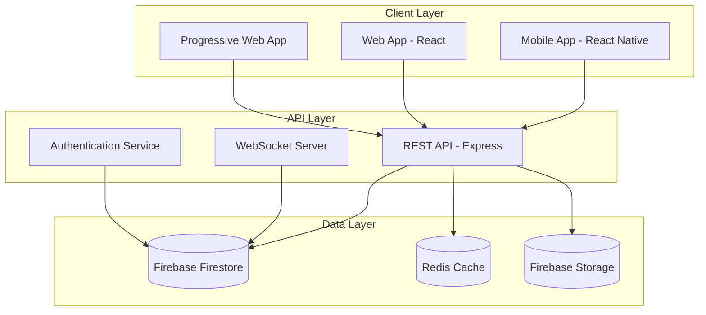
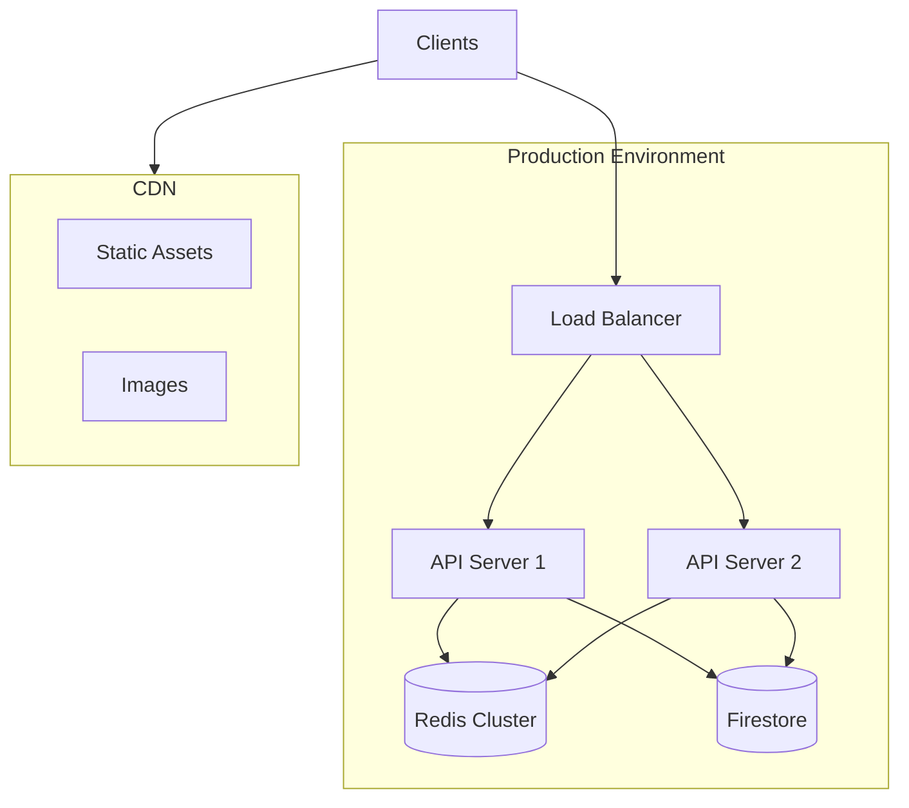

# ShoppingListApp Technical Architecture
## System Overview



## Core Components

### 1. Frontend Architecture

#### Web Application (React)
- **Technology Stack**
  - React 18.3
  - TypeScript
  - Tailwind CSS
  - Redux Toolkit for state management
  - Redux Persist for offline data
  - React Router for navigation

#### Mobile Application (React Native)
- **Technology Stack**
  - React Native
  - TypeScript
  - Redux Toolkit
  - AsyncStorage for local data
  - React Navigation

#### Common Features
- Offline-first architecture
- Real-time synchronization
- Push notifications
- Biometric authentication
- Barcode scanning
- Voice input

### 2. Backend Architecture

#### API Server (Node.js/Express)
- **Core Features**
  - RESTful API endpoints
  - WebSocket server for real-time updates
  - Rate limiting
  - Request validation
  - Error handling
  - Logging and monitoring

#### Authentication System
- Firebase Authentication
  - JWT-based authentication
  - OAuth 2.0 integration
  - Session management
  - Role-based access control (RBAC)

#### Database Layer
- **Firebase Firestore**
  - Real-time data synchronization
  - Automatic scaling
  - Multi-region deployment
  - Offline data persistence

- **Redis Cache**
  - Session storage
  - API response caching
  - Rate limiting data
  - Real-time analytics

### 3. Security Architecture

#### Data Protection
- End-to-end encryption for sensitive data
- AES-256 encryption for stored data
- HTTPS/TLS for all communications
- Input sanitization
- XSS protection
- CSRF protection
- Rate limiting
- Request validation

#### Authentication Security
- Multi-factor authentication
- Biometric authentication
- JWT with short expiration
- Secure password hashing
- Account lockout after failed attempts
- Password complexity requirements

#### Infrastructure Security
- Firebase Security Rules
- API Gateway protection
- DDoS protection
- Regular security audits
- Automated vulnerability scanning
- Backup and disaster recovery

## Data Models

### User Model
```typescript
interface User {
  id: string;
  email: string;
  displayName: string;
  preferences: UserPreferences;
  createdAt: Timestamp;
  lastLogin: Timestamp;
}

interface UserPreferences {
  theme: 'light' | 'dark';
  notifications: NotificationSettings;
  defaultStore: string;
  currency: string;
}
```

### Shopping List Model
```typescript
interface ShoppingList {
  id: string;
  name: string;
  owner: string;
  shared: SharedUser[];
  items: ListItem[];
  store?: Store;
  total: number;
  createdAt: Timestamp;
  updatedAt: Timestamp;
}

interface ListItem {
  id: string;
  name: string;
  quantity: number;
  unit: string;
  category: string;
  price?: number;
  checked: boolean;
  addedBy: string;
  addedAt: Timestamp;
}
```

### Store Model
```typescript
interface Store {
  id: string;
  name: string;
  chain: string;
  location: GeoPoint;
  address: Address;
  hours: BusinessHours;
  categories: string[];
}
```

## API Endpoints

### Authentication
- POST /api/auth/register
- POST /api/auth/login
- POST /api/auth/logout
- POST /api/auth/refresh-token
- POST /api/auth/forgot-password
- POST /api/auth/reset-password

### Shopping Lists
- GET /api/lists
- POST /api/lists
- GET /api/lists/:id
- PUT /api/lists/:id
- DELETE /api/lists/:id
- POST /api/lists/:id/share
- POST /api/lists/:id/items

### User Management
- GET /api/users/me
- PUT /api/users/me
- GET /api/users/preferences
- PUT /api/users/preferences

### Stores
- GET /api/stores
- GET /api/stores/:id
- GET /api/stores/:id/items
- GET /api/stores/nearby

## Real-time Features

### WebSocket Events
```typescript
interface WebSocketEvents {
  // List Events
  'list:created': (list: ShoppingList) => void;
  'list:updated': (list: ShoppingList) => void;
  'list:deleted': (listId: string) => void;
  'list:item:added': (listId: string, item: ListItem) => void;
  'list:item:updated': (listId: string, item: ListItem) => void;
  'list:item:deleted': (listId: string, itemId: string) => void;
  
  // Collaboration Events
  'user:typing': (listId: string, userId: string) => void;
  'user:joined': (listId: string, userId: string) => void;
  'user:left': (listId: string, userId: string) => void;
  
  // System Events
  'system:error': (error: Error) => void;
  'system:notification': (notification: Notification) => void;
}
```

## Security Measures

### Firebase Security Rules
```typescript
rules_version = '2';
service cloud.firestore {
  match /databases/{database}/documents {
    // User profiles
    match /users/{userId} {
      allow read: if request.auth.uid == userId;
      allow write: if request.auth.uid == userId;
    }
    
    // Shopping lists
    match /lists/{listId} {
      allow read: if request.auth.uid in resource.data.shared;
      allow write: if request.auth.uid == resource.data.owner;
      
      match /items/{itemId} {
        allow read: if request.auth.uid in get(/databases/$(database)/documents/lists/$(listId)).data.shared;
        allow write: if request.auth.uid in get(/databases/$(database)/documents/lists/$(listId)).data.shared;
      }
    }
  }
}
```

### API Security Headers
```typescript
const securityHeaders = {
  'Content-Security-Policy': "default-src 'self'",
  'Strict-Transport-Security': 'max-age=31536000; includeSubDomains',
  'X-Content-Type-Options': 'nosniff',
  'X-Frame-Options': 'SAMEORIGIN',
  'X-XSS-Protection': '1; mode=block',
  'Referrer-Policy': 'strict-origin-when-cross-origin'
};
```

## Deployment Architecture



## Monitoring and Analytics

### Key Metrics
- API response times
- Real-time user count
- Error rates
- Database performance
- Cache hit rates
- User engagement metrics
- Feature usage statistics

### Logging Strategy
- Application logs
- Security logs
- Performance metrics
- User activity logs
- Error tracking
- Analytics events

## Disaster Recovery

### Backup Strategy
- Daily automated backups
- Point-in-time recovery
- Multi-region data replication
- Regular backup testing
- Automated recovery procedures

### High Availability
- Multi-region deployment
- Automatic failover
- Load balancing
- Health checks
- Circuit breakers
- Rate limiting

## Future Improvements

### Planned Features
- AI-powered shopping suggestions
- Advanced price comparison
- Automated receipt scanning
- Social features
- Advanced analytics
- Voice commands
- AR navigation in stores

### Technical Improvements
- GraphQL API
- Microservices architecture
- Kubernetes deployment
- Enhanced caching
- Progressive Web App
- Improved offline support
- Blockchain for receipts

